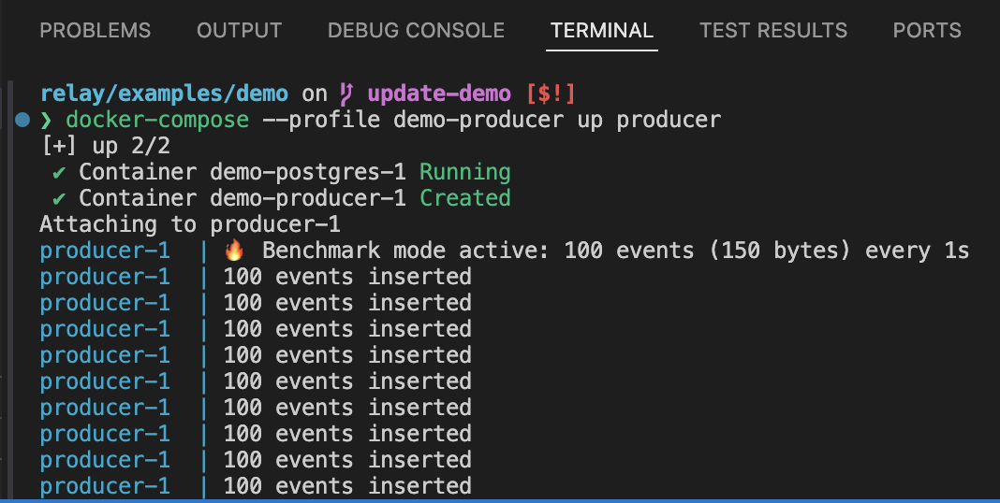
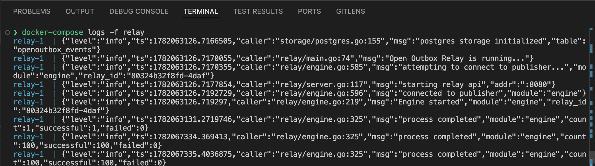
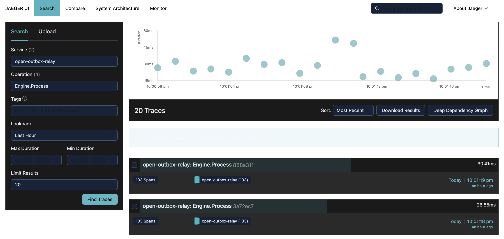
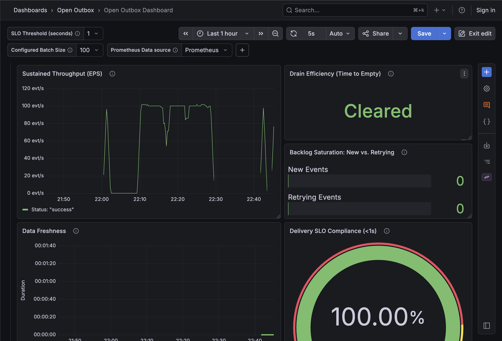

import { Tabs, TabItem, Steps, Aside, Code } from '@astrojs/starlight/components';

The **Open Outbox Relay** is a high-performance bridge that ensures "at-least-once" delivery of events from your database to your message broker.

---

## Live Demo

The fastest way to see the Relay in action is our pre-configured demo environment. It spins up **Postgres**, **NATS**, and the **Relay** automatically.

<Steps>

1. **Start the core services:**

    ```bash
    git clone https://github.com/open-outbox/relay.git
    cd relay/examples/demo
    docker compose up -d
    ```

2. **Choose your ingestion workload:**

    <Tabs>
      <TabItem label="Continuous Load Simulation">
        Trigger the benchmarking profile to stream events continuously into the engine using our optimized load generator.
        Keep this terminal window open!

        ```bash
        docker compose --profile load up producer
        ```

        :::note[Verify Ingestion]
        Once running, the producer will log its batch iterations directly to the console:
        
        :::
      </TabItem>

      <TabItem label="Manual Event (Smoke Test)">
        Insert a single transaction record directly into the Postgres outbox table to verify the plumbing.

        ```bash
        docker compose exec postgres psql -U postgres -d postgres -c \
        "INSERT INTO openoutbox_events (event_id, event_type, payload, partition_key)
        VALUES (gen_random_uuid(), 'openoutbox.events.demo', '{\"id\": 123, \"name\": \"Alice\"}', '123');"
        ```
      </TabItem>
    </Tabs>

3. **Check Relay Throughput:**

    Open a separate terminal window and follow the Relay logs to watch it claim and deliver batches of events continuously to NATS:

    ```bash
    docker compose logs -f relay
    ```

    :::note[Verify Processing]
    The Relay logs will show batches of events processing sequentially for example:

    ```json
    {"level":"info","ts":1782071109.1066883,"caller":"relay/engine.go:325","msg":"process completed","module":"engine","count":100,"successful":100,"failed":0}
    ```
    
    :::

4. **Stop the producer simulation:**

    Whenever you are ready to pause the active traffic generation, switch back to your producer window and press `Ctrl+C`.

</Steps>

---

## Observability & Telemetry

Open Outbox Relay exposes robust OpenTelemetry trace spans and Prometheus metrics.
Spin up the visual telemetry suite to inspect performance metrics and execution paths live.

### 1. Spin up the Telemetry Stack

```bash
docker compose --profile telemetry up -d
```
### 2. Visualize Traces (Jaeger)

1. Open [http://localhost:16686](http://localhost:16686) in your browser.
2. Select Service: `openoutbox-relay`
3. Select an operation (e.g., `Engine.Process`) and click **Find Traces**.

This layout displays exactly how long each phase—Database Claiming versus Broker Publishing—takes for every batch cycle.


### 3. Real-time Metrics (Grafana)

The telemetry suite includes a pre-provisioned Grafana instance mapping native service thresholds out of the box.

1. Open [http://localhost:3000](http://localhost:3000) in your browser.
2. Navigate to the **Dashboards** section → **"Open Outbox"** folder.
3. Select the **"Open Outbox Dashboard"**.

This panel provides real-time visualization of your system's EPS (Events Per Second), Batch Efficiency,
and overall SLO compliance. This dashboard configuration matches our official panel hosted on
[Grafana.com/dashboards/25229](https://grafana.com/grafana/dashboards/25229/).


